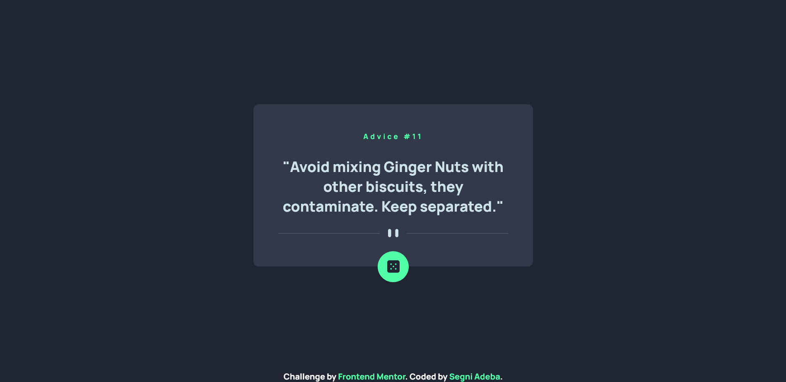
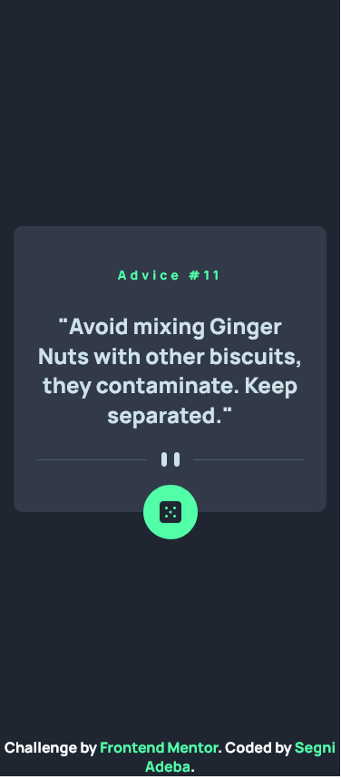

# Frontend Mentor - Advice generator app solution

This is a solution to the [Advice generator app challenge on Frontend Mentor](https://www.frontendmentor.io/challenges/advice-generator-app-QdUG-13db). Frontend Mentor challenges help you improve your coding skills by building realistic projects.

## Table of contents

- [Overview](#overview)
  - [The challenge](#the-challenge)
  - [Screenshot](#screenshot)
  - [Links](#links)
- [My process](#my-process)
  - [Built with](#built-with)
  - [What I learned](#what-i-learned)
  - [Continued development](#continued-development)
  - [Useful resources](#useful-resources)
- [Author](#author)

## Overview

### The challenge

Users should be able to:

- View the optimal layout for the app depending on their device's screen size
- See hover states for all interactive elements on the page
- Generate a new piece of advice by clicking the dice icon

### Screenshot




### Links

- Solution URL: [github](https://github.com/SegniAdebaGodsSon/Frontend-Mentor/tree/master/Advice%20generator%20app/advice-generator-app)
- Live Site URL: [netlify](https://aesthetic-custard-8c902b.netlify.app/)

## My process

### Built with

- Semantic HTML5 markup
- SCSS
- Flexbox
- CSS Flexbox
- Mobile-first workflow
- [React](https://reactjs.org/) - JS library
- [Next.js](https://nextjs.org/) - React framework

### What I learned

While coding out this exercise I've learnt how and when to use the useRef hook in react.

I've also learned more about the useState & useEffect hooks in react specially using them together to create a custom hook such as the following:

```js
let useWindowSize = () => {
	const [windowSizeState, setWindowSize] =
		useState <
		windowSize >
		{
			height: null,
			width: null,
		};

	useEffect(() => {
		// Handler to call on window resize
		const handleResize = () => {
			// Set window width/height to state
			setWindowSize({
				height: window.innerHeight,
				width: window.innerWidth,
			});
		};

		// Add event listener
		window.addEventListener("resize", handleResize);

		// call handler right away that state gets updated with initial window size
		handleResize();

		// remove event listener on cleanup
		return () => window.removeEventListener("resize", handleResize);
	}, []); // Empty array ensures that effect is only run on mount

	return windowSizeState;
};
```

### Continued development

I'd like to focus and master using useEffect in many different scenarios.

### Useful resources

- [Youtube](https://www.youtube.com/watch?v=j1ZRyw7OtZs) - This helped me to understand useEffect more.

## Author

- Frontend Mentor - [@SegniAdebaGodsSon](https://www.frontendmentor.io/profile/SegniAdebaGodsSon)
- Linkedin - [@segniadeba](https://www.linkedin.com/in/segniadeba/)
- email - [@se.segni.adeba](se.segni.adeba@gmail.com)
