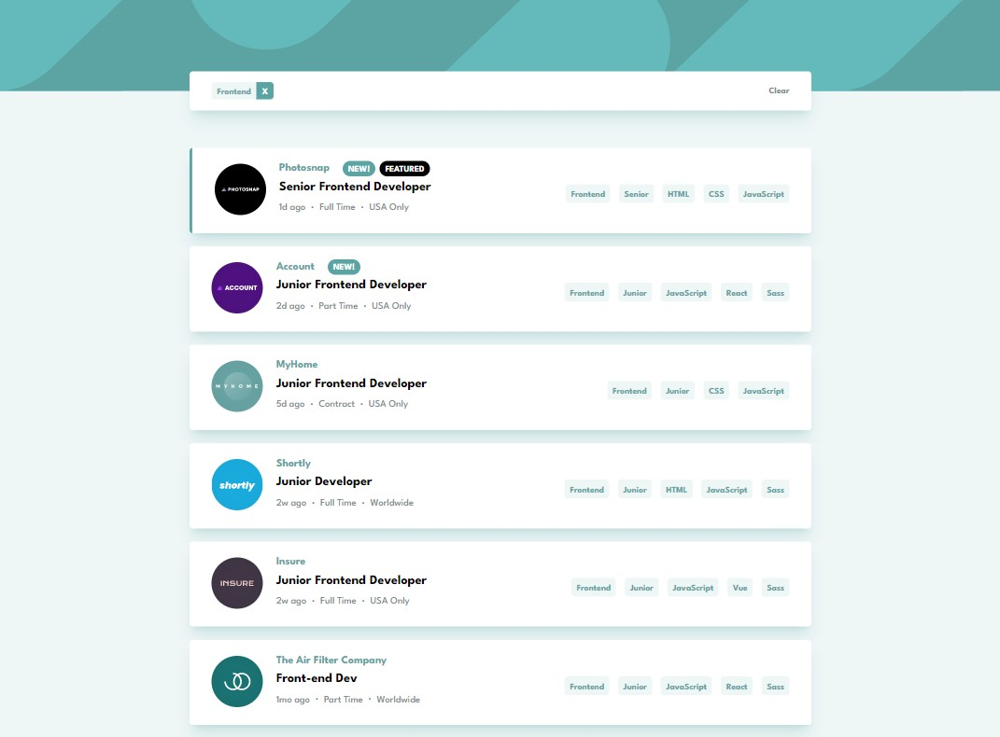
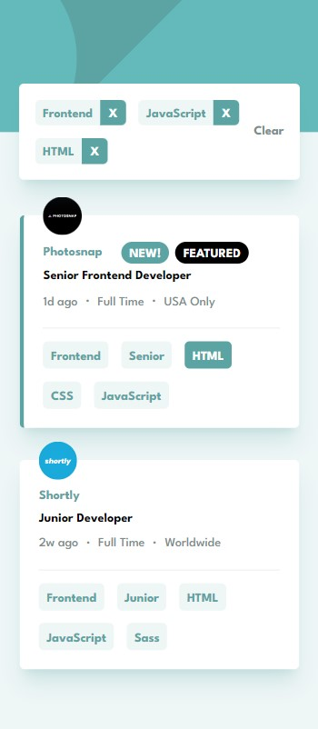

# Frontend Mentor - Job listings with filtering solution

This is a solution to the [Job listings with filtering challenge on Frontend Mentor](https://www.frontendmentor.io/challenges/job-listings-with-filtering-ivstIPCt). Frontend Mentor challenges help you improve your coding skills by building realistic projects.

## Table of contents

-   [Overview](#overview)
    -   [The challenge](#the-challenge)
    -   [Screenshot](#screenshot)
    -   [Links](#links)
-   [My process](#my-process)
    -   [Built with](#built-with)
    -   [What I learned](#what-i-learned)
    -   [Continued development](#continued-development)
    -   [Useful resources](#useful-resources)
-   [Author](#author)

## Overview

### The challenge

Users should be able to:

-   View the optimal layout for the site depending on their device's screen size
-   See hover states for all interactive elements on the page
-   Filter job listings based on the categories

### Screenshot

### Links

-   Solution URL: [Github](https://github.com/SegniAdebaGodsSon/Frontend-Mentor/tree/master/Job%20listings%20with%20filtering/job-listings-with-filtering)
-   Live Site URL: [Netlify](https://shiny-mandazi-d16108.netlify.app/)

## My process

### Built with

-   Semantic HTML5 markup
-   Flexbox
-   Mobile-first workflow
-   [Next.js](https://nextjs.org/) - React framework
-   [Tailwind CSS](https://tailwindcss.com) - For styles

### What I learned

I've learnt how to use React.js hook useContext for the first time to share state and state setter with multiple components which are nested in a complex way.

### Continued development

I want to continue using and improving upon my tailwind css skills and also using useContext hook more often whenever it is appropriate.

### Useful resources

-   [Tailwind CSS](https://www.tailwindcss.com) - This helped me figure out utility class names for my needs.

## Author

-   Frontend Mentor - [@SegniAdebaGodsSon](https://www.frontendmentor.io/profile/SegniAdebaGodsSon)
-   Linkedin - [@segniadeba](https://www.linkedin.com/in/segniadeba/)
-   email - [@se.segni.adeba](se.segni.adeba@gmail.com)
