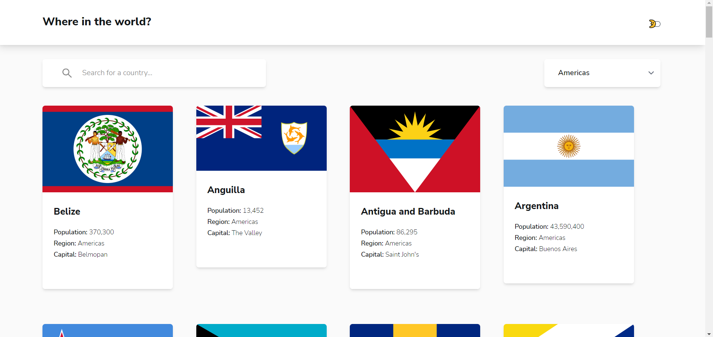

# Frontend Mentor - REST Countries API with color theme switcher solution

This is a solution to the [REST Countries API with color theme switcher challenge on Frontend Mentor](https://www.frontendmentor.io/challenges/rest-countries-api-with-color-theme-switcher-5cacc469fec04111f7b848ca). Frontend Mentor challenges help you improve your coding skills by building realistic projects.

## Table of contents

-   [Overview](#overview)
    -   [The challenge](#the-challenge)
    -   [Screenshot](#screenshot)
    -   [Links](#links)
-   [My process](#my-process)
    -   [Built with](#built-with)
-   [Author](#author)

## Overview

### The challenge

Users should be able to:

-   See all countries from the API on the homepage
-   Search for a country using an `input` field
-   Filter countries by region
-   Click on a country to see more detailed information on a separate page
-   Click through to the border countries on the detail page
-   Toggle the color scheme between light and dark mode _(optional)_

### Screenshot

### Links

-   Solution URL: [Github](https://github.com/SegniAdebaGodsSon/Frontend-Mentor/tree/master/REST%20Countries%20API%20with%20color%20theme%20switcher/rest-countries-api)
-   Live Site URL: [Netlify](https://famous-semolina-d28f74.netlify.app/)

## My process

### Built with

- Semantic HTML5 markup
- Flexbox
- Apollo client
- Mobile-first workflow
- [Tailwind CSS](https://tailwindcss.com) - For styles

### Useful resources

- [Apollo Client Graphql](https://www.apollographql.com/docs/react/) - This helped me figure out how to query countries graphql api.
- [Tailwind CSS](https://www.tailwindcss.com) - This helped me figure out utility class names for my needs.

## Author

- Frontend Mentor - [@SegniAdebaGodsSon](https://www.frontendmentor.io/profile/SegniAdebaGodsSon)
- Linkedin - [@segniadeba](https://www.linkedin.com/in/segniadeba/)
- email - [@se.segni.adeba](se.segni.adeba@gmail.com)
