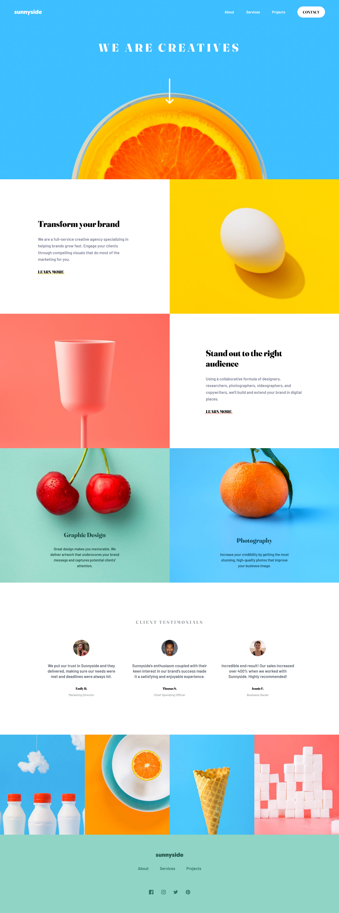

# Frontend Mentor - Sunnyside agency landing page solution

This is a solution to the [Sunnyside agency landing page challenge on Frontend Mentor](https://www.frontendmentor.io/challenges/sunnyside-agency-landing-page-7yVs3B6ef). Frontend Mentor challenges help you improve your coding skills by building realistic projects.

## Table of contents

- [Overview](#overview)
  - [The challenge](#the-challenge)
  - [Screenshot](#screenshot)
  - [Links](#links)
- [My process](#my-process)
  - [Built with](#built-with)
  - [What I learned](#what-i-learned)
- [Author](#author)

## Overview

### The challenge

Users should be able to:

- View the optimal layout for the site depending on their device's screen size
- See hover states for all interactive elements on the page

### Screenshot




### Links

- Solution URL: [github](https://github.com/SegniAdebaGodsSon/Frontend-Mentor/tree/master/Sunnyside%20agency%20landing%20page/sunnyside-agency-landing-page)
- Live Site URL: [netlify](https://zesty-maamoul-f5c473.netlify.app/)

## My process

### Built with

- Flexbox
- SCSS
- Mobile-first workflow
- [React](https://reactjs.org/) - JS library
- [Next.js](https://nextjs.org/) - React framework

### What I learned

I learned one way of closing a dropdown when outside of the dropdown is clicked. By adding a 'click' listener to the body of the document, on click it checks if the clicked are is inside or outside of the wanted area.

To see how you can add code snippets, see below:

```js
const [dropdown, setDropdown] = useState(false);

const hamburgerRef = useRef(null);
const dropdownRef = useRef(null);

const closeDropdown = (e: any) => {
	let inside = false;
	if (e.path) {
		e.path.forEach((el: any) => {
			inside =
				inside || el == hamburgerRef.current || el == dropdownRef.current;
		});

		if (!inside) {
			setDropdown(false);
		}
	}
};

useEffect(() => {
	document.body.addEventListener("click", closeDropdown);

	return () => {
		document.body.removeEventListener("click", closeDropdown);
		setDropdown(false);
	};
}, []);
```

## Author

- Frontend Mentor - [@SegniAdebaGodsSon](https://www.frontendmentor.io/profile/SegniAdebaGodsSon)
- Linkedin - [@segniadeba](https://www.linkedin.com/in/segniadeba/)
