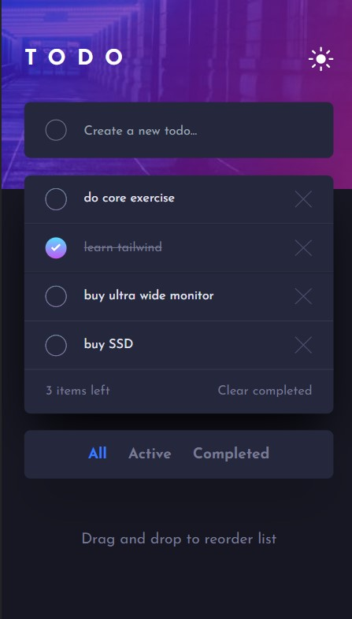

# Frontend Mentor - Todo app solution

This is a solution to the [Todo app challenge on Frontend Mentor](https://www.frontendmentor.io/challenges/todo-app-Su1_KokOW). Frontend Mentor challenges help you improve your coding skills by building realistic projects.

## Table of contents

-   [Overview](#overview)
    -   [The challenge](#the-challenge)
    -   [Screenshot](#screenshot)
    -   [Links](#links)
-   [My process](#my-process)
    -   [Built with](#built-with)
    -   [What I learned](#what-i-learned)
    -   [Continued development](#continued-development)
    -   [Useful resources](#useful-resources)
-   [Author](#author)

## Overview

### The challenge

Users should be able to:

-   View the optimal layout for the app depending on their device's screen size
-   See hover states for all interactive elements on the page
-   Add new todos to the list
-   Mark todos as complete
-   Delete todos from the list
-   Filter by all/active/complete todos
-   Clear all completed todos
-   Toggle light and dark mode
-   **Bonus**: Drag and drop to reorder items on the list

### Screenshot

### Links

-   Solution URL: [Github](https://github.com/SegniAdebaGodsSon/Frontend-Mentor/tree/master/Todo%20App/todo-app)
-   Live Site URL: [Netlify](https://symphonious-moxie-32fd81.netlify.app/)

## My process

### Built with

-   Semantic HTML5 markup
-   Flexbox
-   Mobile-first workflow
-   [Next.js](https://nextjs.org/) - React framework
-   [Tailwind CSS](https://tailwindcss.com) - For styles

### What I learned

I've learned how to emplement dark/light mode theme swithing using tailwind css and how to apply different styles based on what the current theme is. I've also learned how to make an element draggable and also slot it next to a particular element on the DOM.

### Continued development

I'd like to involve dark/light mode theme switching in my future project, whenever necessary or appropriate.

### Useful resources

-   [Tailwind CSS](https://www.tailwindcss.com) - This helped me figure out utility class names for my needs.

-   [Drag and reorder](https://youtu.be/jfYWwQrtzzY) - This video helped me know how to reorder DOM elements with drag and drop.

## Author

-   Frontend Mentor - [@SegniAdebaGodsSon](https://www.frontendmentor.io/profile/SegniAdebaGodsSon)
-   Linkedin - [@segniadeba](https://www.linkedin.com/in/segniadeba/)
-   email - [@se.segni.adeba](se.segni.adeba@gmail.com)
